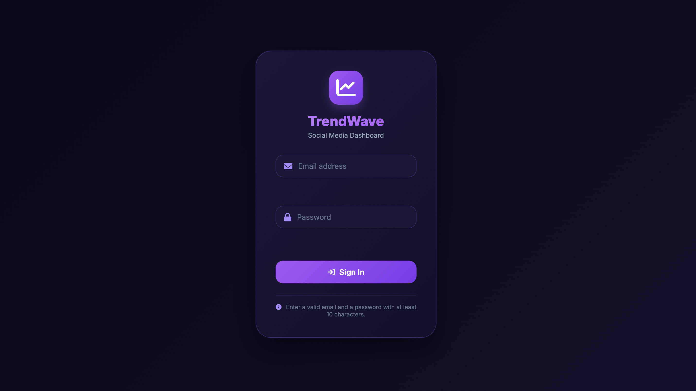
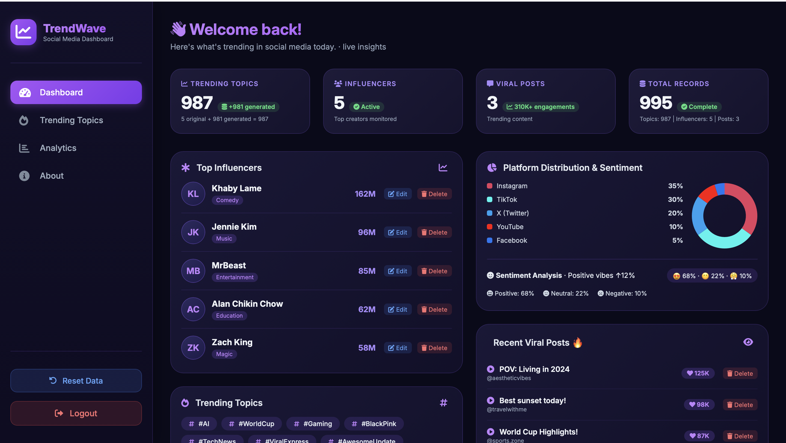
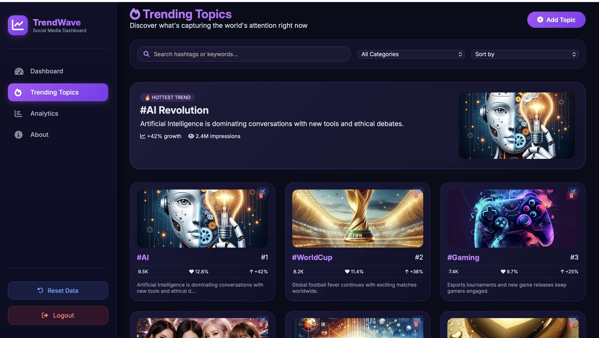
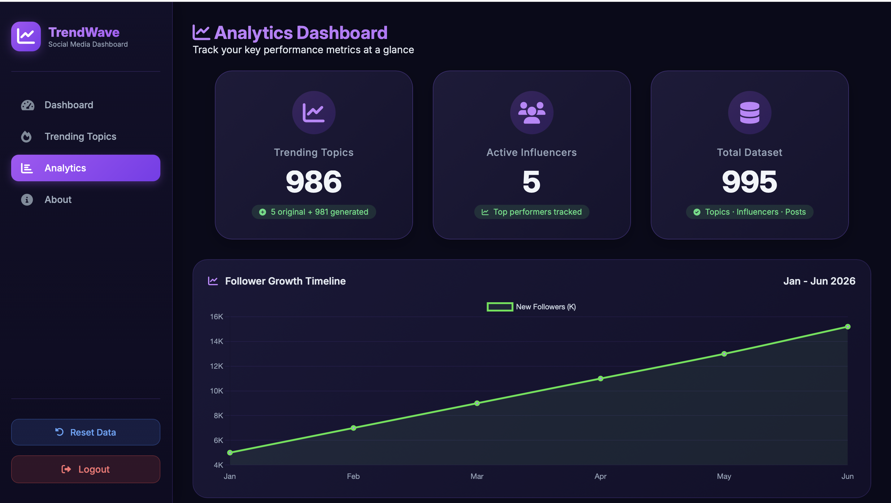

# TrendWave — Social Media Dashboard

TrendWave is an interactive web-based social media dashboard designed to visualize and analyze trending topics, influencers, viral posts, and social media engagement metrics.

The project provides a modern dashboard interface with data visualization, search, filtering, sorting, pagination, and data management features.

## Features

- Interactive social media dashboard
- User login interface with input validation
- Trending topics analysis
- Influencer monitoring
- Viral posts tracking
- Analytics dashboard with interactive charts
- Search functionality
- Category filtering
- Sorting by mentions, engagement, and growth
- Paginated trending topics
- Add, edit, and delete topics
- Edit and delete influencers
- Delete viral posts
- Reset dataset functionality
- Local data persistence using LocalStorage
- Business rule validation
- Responsive dark-themed interface
- Platform distribution visualization
- Sentiment analysis visualization
- Trend and follower growth charts


## Screenshots

### Login


### Dashboard


### Trending Topics


### Analytics

## Technologies Used

- HTML5
- CSS3
- JavaScript
- Chart.js
- Font Awesome
- LocalStorage

## Dashboard Sections

### Dashboard

The main dashboard provides an overview of:

- Trending topics
- Active influencers
- Viral posts
- Total records
- Platform distribution
- Sentiment analysis
- Recent viral posts
- Trend growth

### Trending Topics

Users can explore trending topics through:

- Search
- Category filters
- Sorting
- Topic cards
- Ranking tables
- Pagination
- Topic editing and deletion
- Adding new topics

Each topic contains information such as its hashtag, rank, mentions, engagement, growth, category, description, and status.

### Analytics

The Analytics section provides visual representations of social media data, including:

- Trending topic statistics
- Influencer statistics
- Dataset overview
- Follower growth timeline
- Trend growth comparison

### About

The About section describes the project, its purpose, technologies, features, and business rules.

## Data Management

TrendWave uses JavaScript objects and LocalStorage to manage application data.

The dashboard includes sample data for:

- Trending topics
- Influencers
- Viral posts

Data changes made through the dashboard can be stored locally in the browser.

## Business Rules

The application implements several validation rules:

1. A topic must have at least 2,000 mentions (2.0K).
2. Engagement rate must remain between 0% and 100%.
3. Topics with growth below 10% are automatically marked as **Stable**.
4. Topics with growth of 10% or higher are marked as **Trending**.

## Project Structure

```text
social-media-dashboard/
│
├── images/
│   ├── ai-topic.jpg
│   ├── blackpink-topic.jpg
│   ├── default-topic.jpg
│   ├── featured-post.jpg
│   ├── gaming-topic.jpg
│   ├── other-topic.jpg
│   ├── technews-topic.jpg
│   └── worldcup-topic.jpg
│
├── index.html
├── index.js
├── style.css
├── .gitignore
└── README.md